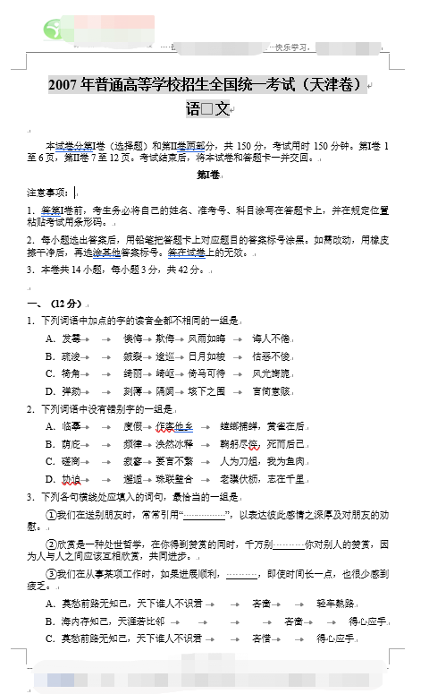

# Exam Master

Parse Chinese exam paper to structured questions.

## Demo

### Raw Paper Word Document (`.docx`)



### Parsed Result

#### Warnings

- Too long choice content. Maybe there lacks a question number:  

D．保护具体的专利是为了体现专利的公益性，与之不同的是，保护自然遗产、文化传统则是体现其排他性。

**`<Actually, here lacks a question number, but the parser won't show this specific position and this tip here is just for demo>`** 阅读下面的文字，完成8～10题。

科技的进步把人类的种种幻想变成现实，上古时代异想天开的“造人”神话，将在当代科学家手中实现，以人造肌肉为主要材料制成的“类人机器人”正款款向我们走来。

科学家发现，非金属材料能在电流的作用下运动，于是产生了制造人造肌肉的构想。研究表明，通过电流刺激，高分子材料能自动伸缩的弯曲，从而可用来制造人造肌肉。这种人造肌肉用黏合性逆料制成，是把管状导电塑料集束成肌肉一样的复合体。在管内注入特殊液体，导电性高分子在溶液中释放出离子，这种复合体在电流的刺激下完成伸缩动作，通过控制电流强弱调整离子的数量，可以有效地改变它的伸缩性。相反，通过改变复合体的形状也可以产生电。

人造肌肉具备人体肌肉的功能。在人造肌肉中，一根直径为0.25毫米的管状导电塑料可承量20克，相同的体积，人造肌肉比人体肌肉的力量强10倍。传统引擎驱动的机器人，除了关节之外，四肢没有任何可以活动的关联处，能量上自然是捉襟见肘。如果有了人造肌肉，机器人四肢就会更加发达，能将分子能量的70%转化为物理能量，其功率远远大于传统引擎机器人。近年来，一种名为Birod的生物机器人已问世，它可以负载超过自身许多倍的重量。科学家正在研制于未来士兵装备的人造肌肉。这种人造肌肉一旦装入手套、制服和军靴，士兵就会有超人的力量、举重物、跳高墙均不在话下。

利用人造肌肉可以发电的原理，科学家正在开发一种“脚后跟”发电机，即把人造肌肉安装在军靴的鞋跟上，通过步行、跑步等运动就能发电。未来，凡是需要小型电动引擎的制造业，人造肌肉都有用武之地。

人造肌肉灵活柔软，还可以用来制造医用导管和在救灾中大显身手的蛇形机器人。目前已经有了利用人造肌肉制成的机器鱼，它在水中游动的姿态与真鱼没什么差别，“耐力”可保持半年时间。机器鱼既没有马达、机轴、齿轮等机械装置，也没有电池，完全是靠伸缩自如的高分子材料自行驱动。

#### Structured Output

> You will see many indented `--`s, which represent the question structures (levels).
> 
> Also, extracted scores are in &lt;..&gt;, and selective questions will have additional info about the selecting count.

```
******第Ⅰ卷******
-- 一、 <12 分>: （12分）
  -- 1． <0 分>: 下列词语中加点的字的读音全都不相同的一组是

A．发霉		懊悔	欺侮	风雨如晦	诲人不倦
B．疏浚		皴裂	逡巡	日月如梭	怙恶不悛
C．犄角		绮丽	崎岖	倚马可待	风光旖旎
D．弹劾		刻薄	隔阂	垓下之围	言简意赅

  -- 2． <0 分>: 下列词语中没有错别字的一组是

A．临摹		度假	作客他乡	螳螂捕蝉，黄雀在后
B．荫庇		频律	涣然冰释	鞠躬尽悴，死而后已
C．磋商		寂寥	要言不繁	人为刀俎，我为鱼肉
D．协迫		邂逅	珠联璧合	老骥伏枥，志在千里

  -- 3． <0 分>: 下列各句横线处应填入的词句，最恰当的一组是

①我们在送别朋友时，常常引用“                ”，以表达彼此感情之深厚及对朋友的劝慰。
②欣赏是一种处世哲学，在你得到赞赏的同时，千万别          你对别人的赞赏，因为人与人之间应该互相欣赏，共同进步。
③我们在从事某项工作时，如果进展顺利，          ，即使时间长一点，也很少感到疲乏。
A．莫愁前路无知己，天下谁人不识君		吝啬		轻车熟路
B．海内存知己，天涯若比邻				吝啬		得心应手
C．莫愁前路无知己，天下谁人不识君		吝惜		得心应手
D．海内存知己，天涯若比邻				吝惜		轻车熟路

  -- 4． <0 分>: 下列各句中没有语病且句意明确的一句是

A．王维在继承传统的基础上，努力创造的具有鲜明个性的意境，丰富和提高了山水诗的表现技巧，对诗歌发展做出了贡献。
B．为确保大熊猫入港随俗，科研人员专门安排它们接受语言训练，提升普通话、广东话和英语的能力，为在香港定居做好准备。
C．许多投资者不了解证券投资和基金产品的风险，没有区别股票和基金产品与储蓄、债券的差异，贸然进行证券和基金投资。
D．作为古海岸与湿地同处一地的国家级自然保护区，七里海是京津唐三角地带其难得的一片绿洲，被誉为天津滨海地区既大又美的花园。

-- 二、 <18 分>: （18分）

阅读下面的文字，完成5～7题。
发展中国家的一些企业家对专利有一种顶礼膜拜的心态。对内以为只要有了专利就保护了自己的知识资产，对外财将人家注册的专利视为神圣不可侵犯的。世界上每天都有几百个专利注册成功，也有相当一些专利在诉讼中被判无效。知识产权和私权，本质上是保护排他性权益，有争议是正常的，我们应该尊重保护知识产权的原则和被这些原则认可的技术发明，同样也尊重法律给予他人争辩乃至否定这种保护的权利。所以对具体专利的保护与对自然遗产、文化传统的保护在性质上绝不能同日而语。
缺乏竞争意识的知识产权战略追求的只是获得专利，这种“唯专利论”让企业围着知识产权转。一些企业、科研机构现在知道着力培养帮助注册专利的人才，而对培养在市场竞争中游刃有余、懂技术又有法律资格的专利律师，尚未提到议事日程。然而，市场经济告诉我们，虽然花费很大的借价保护专利，但在利益驱动下，竞争对手往往会千方百计地来破解对专利的保护。
在当今中国，绝大多数企业和科研机构尚处在技术积累期，还必须鼓励多申请专利。在目前已经注册的专利中属于发明类的比较少，而属于实用新型的和外观设计型的较多，这种状况一时难以改变，无须责难。特别是不要轻易把某些专利判定为垃圾专利，因为专利不一定以开发产品或服务为最终目的，全世界的专利总量中只有很小一部分可以实现经济价值。有些专利是出于企业的长期战略考虑暂时不会去产品化，有些仅仅是防止别人进入的篱笆，还有些专利注册行是为了迷惑对方，或是准备与对方权利交换用的。
企业的专利战略如果从市场竞争出发，就会有无比丰富的内容。在一定条件下不申请专利也是一种知识产权战略。对十分容易被模仿而又难以赢得诉讼的，不申请专利而将这种技术作为商业秘密加以保护可能更加有利。与专利不同，商业秘密没有义务公开技术内容，保护时间可以没有期限。放弃一部分专利也是一种竞争手段。IBM公司宣布建立一个专利共享平台，放弃价值千万美元的500多项专利，供社会免费使用。这些专利与开源软件开发有关，这样能够做大以开源软件为基础的大量下游企业，为公司自己的产品扩大了市场，其结果恰恰是对竞争对手微软公司的产品构成了重大的挑战。

  -- 5． <0 分>: 下列不属于“唯专利论”表现的一项是

A．把专利数量和规模作为企业知识产权战略追求的目标，着力培养专利注册人才。
B．认为有了专利即可有效保护自己的知识资产，别人无权争辩或否定。
C．积极申请专利，而对有些专利并不急于实现其经济价值。
D．将所有的技术发明都及时地申报专利，并为之付出很大代价加以保护。

  -- 6． <0 分>: 下列对本文所主张的知识产权战略的理解，不正确的一项是

A．将符合知识产权原则的技术发明注册为专利，并采取一系列策略维护自己的专利权。
B．对专利制度难以保护的、易被模仿又难以胜诉的技术发明，可以不申请专利，而将其作为商业秘密加以保护。
C．可以通过部分专利共享，做大下游企业，提高市场竞争能力。
D．面对市场竞争，把培养懂技术又有法律资格的专利律师列为远期目标。

  -- 7． <0 分>: 下列对本文有关内容的分析，正确的一项是

A．在专利总量中小部分可以实现经济价值，防止对手涉足或迷惑对手的专利则具有战略价值。
B．在技术积累期，采取鼓励申请专利的措施后，大多数企业的专利中发明类的多了，实用类的少了。
C．基于市场竞争的知识产权战略，应主要采取专利以外的手段，比如暂时不将专利产品化、主动放弃部分专利等。
D．保护具体的专利是为了体现专利的公益性，与之不同的是，保护自然遗产、文化传统则是体现其排他性。
阅读下面的文字，完成8～10题。
科技的进步把人类的种种幻想变成现实，上古时代异想天开的“造人”神话，将在当代科学家手中实现，以人造肌肉为主要材料制成的“类人机器人”正款款向我们走来。
科学家发现，非金属材料能在电流的作用下运动，于是产生了制造人造肌肉的构想。研究表明，通过电流刺激，高分子材料能自动伸缩的弯曲，从而可用来制造人造肌肉。这种人造肌肉用黏合性逆料制成，是把管状导电塑料集束成肌肉一样的复合体。在管内注入特殊液体，导电性高分子在溶液中释放出离子，这种复合体在电流的刺激下完成伸缩动作，通过控制电流强弱调整离子的数量，可以有效地改变它的伸缩性。相反，通过改变复合体的形状也可以产生电。
人造肌肉具备人体肌肉的功能。在人造肌肉中，一根直径为0.25毫米的管状导电塑料可承量20克，相同的体积，人造肌肉比人体肌肉的力量强10倍。传统引擎驱动的机器人，除了关节之外，四肢没有任何可以活动的关联处，能量上自然是捉襟见肘。如果有了人造肌肉，机器人四肢就会更加发达，能将分子能量的70%转化为物理能量，其功率远远大于传统引擎机器人。近年来，一种名为Birod的生物机器人已问世，它可以负载超过自身许多倍的重量。科学家正在研制于未来士兵装备的人造肌肉。这种人造肌肉一旦装入手套、制服和军靴，士兵就会有超人的力量、举重物、跳高墙均不在话下。
利用人造肌肉可以发电的原理，科学家正在开发一种“脚后跟”发电机，即把人造肌肉安装在军靴的鞋跟上，通过步行、跑步等运动就能发电。未来，凡是需要小型电动引擎的制造业，人造肌肉都有用武之地。
人造肌肉灵活柔软，还可以用来制造医用导管和在救灾中大显身手的蛇形机器人。目前已经有了利用人造肌肉制成的机器鱼，它在水中游动的姿态与真鱼没什么差别，“耐力”可保持半年时间。机器鱼既没有马达、机轴、齿轮等机械装置，也没有电池，完全是靠伸缩自如的高分子材料自行驱动。

  -- 8． <0 分>: 下列对“人造肌肉”有关内容的理解，正确的一项是

A．人造肌肉可使高分子材料自动伸缩和弯曲。
B．人造肌肉的伸缩程度在电流发生变化时可以发生变化。
C．人造肌肉的巨大能量来源于其伸缩动作所产生的能量。
D．人造肌肉比人体肌肉力量更强，从而具有比人体肌肉更好的性能。

  -- 9． <0 分>: 下列表述符合本文意思的一项是

A．人造肌肉的特征是可自动伸缩和弯曲，在自动伸缩和弯曲时产生电。
B．装有人造肌肉的机器人能在各个领域发挥作用，是因为人造肌肉具有灵活性。
C．装有人造肌肉的机器人四肢发达，其功率比传统引擎驱动的机器人的功率大。
D．人造肌肉使类人机器人在军事和民用方面代替传统机器人完成了任务。

  -- 10． <0 分>: 根据本文提供的信息，下列推断不合理的一项是

A．高分子材料在一定条件下释放出的离子数量与人造肌肉的伸缩程度有关。
B．采用了人造肌肉的机器人能将分子能量转化为物理能量，能自行驱动和负重。
C．未来装有人造肌肉的军靴既可使士兵具有强大的力量，又可充当小型发电机。
D．用人造肌肉制成的机器鱼，可以在没有外力作用的条件下持续不断地游动。

-- 三、 <12 分>: （12分）

阅读下面的文言文，完成11～14题。
夫传言不可以不察，数传而白为黑，黑为白。故狗似玃，玃似母猴，母猴似人，人之与狗则远矣。此愚者之所以大过也。
闻而审，则为福矣;闻而不审，不若不闻矣。齐桓公闻管子于鲍叔，楚庄闻孙叔敖于沈尹筮，审之也，故国霸诸侯也。吴王闻越土勾践于太宰嚭，智伯闻赵襄子于张武，不审也。故国亡身死也。
凡闻言必熟论，其于人必验之以理。鲁哀公问于孔子曰：“乐正夔[注]一足，信乎？”孔子曰：“昔者舜欲以乐传教于天下，乃令重黎举夔于草莽之中而进之，舜以为乐正。夔于是正六律，和五声，以通八风。而天下大服。重黎又欲益求人，舜曰：‘夫乐，天地之精也，得失之节也。故唯圣人为能和乐之本也。夔能和之，以平天下，若夔者一而足矣。’故曰‘夔一足’，非“一足”也。”宋之丁氏家无井，而出溉汲，常一人居外。及其家穿井，告人曰：“吾穿井得一人。”有闻而传之者曰：“丁氏穿井得一人。”国之道之，闻之于宋君。宋君令人问之于丁氏，丁氏对曰：“得一人之使，非得一人于井中也。”求闻之若此，不若无闻也。子夏之晋，过卫，有读史记者曰：“晋师三豕涉河。”子夏曰：“非也，是己亥也。夫已与三相近，豕与亥相似。”至于晋而问之，则日，晋师己亥涉河也。
辞多类非而是，多类是而非，是非之经，不可不分，此圣人之所慎也。然则何以慎？缘物之情及人之情，以为所闻，则得之矣。（《吕氏春秋·慎行论·察传》）
［注］乐正，乐官之长。夔，人名。

  -- 11． <0 分>: 对下列句子中加点的词的解释，不正确的一项是

A．乐正夔一足，信乎							信：相信
B．乃令重黎举受于草莽之中而进之				进：进用
C．夫乐，天地之精也，得失之节也				节：关键
D．宋之丁氏家无井，而出溉汲					汲：打水

  -- 12． <0 分>: 下列句子中加点的词的意义和用法，不相同的一组是

A．
B．
C．
D．

  -- 13． <0 分>: 下列各项中每句话都能体现本文主旨的一项是

①夫传言不可以不察。
②闻而审，则为福矣；闻而不审，不若不闻矣。
③凡闻言必熟论，其于人必验之以理。
④求闻之若此，不若无闻也。
⑤是非之经，不可不分，此圣人之所慎也。
⑥缘物之情及人之情，以为所闻，则得之矣。
A．①②⑤
B．①③⑥
C．②④⑤
D．③④⑥

  -- 14． <0 分>: 下列对本文的理解和分析，不正确的一项是

A.第二段通过齐桓、楚庄王、吴王、智伯的故事，说明对别人的话要仔细分析，认真核查。
B．第三段与夔、丁氏、子夏有关的文字，说明不结合语言环境，不推究事理，就会造成误解、误传。
C．本文分别以生活事例、历史事实和寓言故事作为论据，夹叙夹议，深入浅出。
D．文中有的事例“类是而非”，有的事例“类非而是”，分别从正反两方面进行论证。

-- 四、 <18 分>: （18分）
  -- 15． <8 分>: 把文言文中画横线的语句翻译成现代汉语。（8分）
    -- （1） <0 分>: 此愚者之所以大过也。

译文：_________________

    -- （2） <0 分>: 故曰“夔一足”，非“一足”也。

译文：___________________

    -- （3） <0 分>: 有读史记者曰：“晋师三豕涉河。”

译文：____________________

  -- 16． <5 分>: 阅读下面的诗，回答问题。（5分）

黄氏延绿轩（明）高启
葱葱溪树暗，靡靡江芜[注]湿。
雨过晓开帘，一时放春入。
［注］芜，丛生的草

    -- （1） <0 分>: “葱葱”、“靡靡”两个叠音词有什么作用？

答：________________________

    -- （2） <0 分>: “一时放春入”表现了怎样的情景？

答：_________________________

  -- 17． <5 分>: 补写下列句中的空缺部分（两组中只选一组）。（5分） [（两组中只选一组）:1]
    -- （1） <0 分>: 
      -- ① <0 分>: 贾谊在《过秦论》中写道：“然秦以区区之地，                          ，

百有余年矣。”

      -- ② <0 分>: 秦观在《         》词中写道：“纤云弄巧，飞星传恨，银汉迢迢暗度。                         ，                          。 ”
    -- （2） <0 分>: 
      -- ① <0 分>: 王安石在《游褒禅山记》中写道：“余于仆碑，          ，               ，

何可胜道也哉！”

      -- ② <0 分>: 杜甫在《         》诗中写道：“                 ，                   。

花径不曾缘客扫，蓬门今始为君开。”

-- 五、 <18 分>: （18分）

阅读下面的文字，完成18～21题。
雪 野 里 的 精 灵    李存葆
东坡居士面对邈远天昊，苍茫坤舆，曾浩叹“寄蜉游于天地，渺沧海之一粟”。我真正体味出这两句话的奥义，是在多次晋谒了一棵巨树之后。
那是苔县城西定林寺中的银杏树。它苍劲葱郁，主枝周逸旁出，状若硕大无朋的莲花。我第一次站在它下面时，顿被一种强大的生命光波所震慑，所征服，所溶解。它那腾游时空的气魄，吐纳古今的恢宏，剪裁春秋的博大，抽黄谢绿的顽强，都使我感到自己的渺小和卑微。
后来，我又多次拜谒它，每每都会对苏轼的话产生新的感悟。它的前句喻生命短暂如蜉蝣，后句指生命渺小如沧海一粟。人类虽然可以嘲笑“朝菌不如晦朔，蟪蛄不知春秋”，但站在这棵古树前，仰望着无涯无际的时空，我们便会感到：在宇宙间，地球仅是一粒微尘，人生更如蜉蝣、朝菌，只不过俄尔一瞬，稍纵即逝。
博大与渺小，久远与暂短，都是相对而言的。定林寺里的古银杏无疑是一支巍峨峥嵘的生命进行曲。后来我在雪野中两次偶然所见，则又领略了弱小生命吟出的生的礼赞。
那是七十年代末的一个暮冬，我到崂山顶峰的驻军观察哨采访。大雪后的崂山，峰若玉雕，石似晶铸。我与哨长挟石踏雪，拽枝腾挪，来到一向阳处的山坳。这里，我猛然发现，向阳的竹林边，竟有柔草如菌，毛茸茸，青翠翠，密匝匝，在这银色的世界里，织出了一小片绿毯。
哨长在这绿毯边沿旁的一巨石前，小心翼翼地用双手扒开雪层，并唤我过去观看。当我走至巨石下，呈现我面前的竟是一片美妍的小花。小花一株株、一簇簇，攒攒挤挤，比肩争头。这些小花仅比米粒儿稍大，白的、紫的、蓝的、红的、黄的，五颜六色，星星点点。看到如此众多的小生命，坚忍不拔而又蓬蓬勃勃地活在这雪地里，我的眼睛被染得灿烂起来。我惊异地看着这些小生命，它们也仿佛睁着深情的眼睛凝望着我……这些米粒般大小的生命，像是在告喻我：希冀、渴望、追恋、向往，是一切生命的本质。即使天冷了地冷了宇宙的一切都冷了，它们也会顽强地举起美的萌芽，决不肯把生命的蓬帆轻易降落。
这些美的萌芽，是春的启明星，正在呼唤着春蕊的艳丽，春树的繁茂，春蚕的吐丝……
前年元宵节前夕，我应长白山林场友人之邀，曾到雪国一游。一日下午，我和友人在莽莽的安睡着的一片杉林里漫游。蓦地，有几点蓝色的彩光在雪地里闪动，一下跃入我的眼帘，燃亮了我的又瞳。我趋前蹲下细瞧，竟是几朵蓝色的小花。这蓝色的小生命，由纤纤的细茎挑着，那吹弹得破的花萼，显得那样稚嫩和孱弱。
这雪国中的蓝色小生命，纤细里充溢着坚韧，孱弱里蕴藏着刚强，微小里含纳着博大；这小小的生命里，也浸透着星的璀璨，月的妩媚，日的明丽。它们以小小的蓝色火焰与巨大的寒流搏击，它们以火热的心律终于鼓破了厚厚的冰窖，它们是这漫漫雪国里生命的精灵！友人告诉我，这蓝色的小花名叫“白头翁”。
定林寺中的银杏树，崂山雪地的小花小草，还有这雪国中的“白头翁”，都是造物主无与伦比的杰作，都是生命的奇观……
人们惯常喜爱吟诵参天的大树，喜爱聆听它们博大生命的浩歌。但浩歌是一种境界，寂寞也是一种境界。浩歌是夏的宣言与旗帜，寂寞则是春的预报和序曲。
天无私覆，地无私载。对憧憬着春天却不能轰轰烈烈、大红大紫的众多的小花小草，谁也没有权利去有意或无意地践踏它们……（选自《新世纪文学选刊》2008年8月号，有删改）

  -- 18． <4 分>: 文章把小花称作“雪野里的精灵”，意在表现小花的哪些特点？（4分）

答：__________________

  -- 19． <4 分>: 请赏析“看到如此众多的小生命，坚忍不拔而又蓬蓬勃勃地活在这雪地里，我的眼睛被染得灿烂起来”这句话。（4分）

答：_______________________

  -- 20． <6 分>: 文章说“浩歌是一种境界，寂寞也是一种境界”。两种“境界”分别指什么？二者有何相同点？（6分）

答：_____________________

  -- 21． <4 分>: 下一对文章的理解和分析，正确的两项是（4分）

A．银杏树以其在时空中的伟大，谱写了巍峨峥嵘的生命进行曲，“我”从第一次见到它开始，就一直感到自己的渺小与卑微。
B．文章提到古人嘲笑“朝菌”、“蟪蛄”生命短暂的话，目的是以人的浅薄自大来补托小花小草的伟大。
C．“它们也会顽强地举起美的萌芽”，其中的“美”，不仅指小花的外观，也指它们的精神。
D．本文先以苏轼的话开篇，然后用生活中的三个场景，从三个角度说明生命的力量，最后收束全文，含意深远。
E．结尾一段的意思是，我们应像天地公平地对待万物一样，善待那些弱小生命。
答：（     ）（     ）

-- 六、 <12 分>: （12分）
  -- 22． <2 分>: 给下面一段话加上标点符号（答案依次写在文后的横线上）。（2分）

语言是思维的工具。著名哲学家、物理学家爱因斯坦说 ① 一个人的智力发展和他形成概念的方法在很大程试上是取决于语言的 ②   ③  爱因斯坦文集 ④ 第一卷 ⑤ 第395页 ⑥ 一个没有很好掌握语言这一思维工具的人，其智力发展会受到很大的限制。

    -- ①  <0 分>: 
    -- ②  <0 分>: 
    -- ③  <0 分>: 
    -- ④  <0 分>: 
    -- ⑤  <0 分>: 
    -- ⑥ <0 分>: 
  -- 23． <4 分>: 在下面横线，续写两句话。（4分）

兰因春而存在，而春也因有了兰的幽美，才多了些温煦，少了些清寒；
荷因夏而存在，而夏也因有了荷的淡雅，才多了些凉爽，少了些燥热；
_________________________________________________________________。

  -- 24． <6 分>: 根据下表写一则短讯，报道本市2007年“五一”黄金周的旅游情况。（6分）

___________________________________________________________________________

-- 七、 <60 分>: （60分）
  -- 25． <60 分>: 请以“有句话常挂在嘴边”为题写一篇文章。（60分）

要求：①除诗歌之外，文体不限。②不少于800字。
作文评分表（供评卷人填写）
```